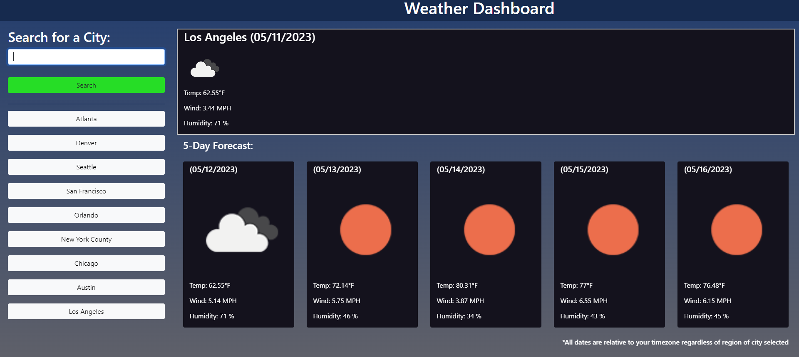

# WeatherForecast

## Description

A simple weather app that searches current weather and a five day forecast for cities using server side APIs.

## Installation

Once the repo has been downloaded, you can open the webpage by opening on the index.html file.

## Usage

https://monstergog.github.io/WeatherForecast/

After opening the webpage, submit an API key for OpenWeatherMap when prompted. Once the page is loaded, search for a city using the search bar to view its weather conditions. If you have already searched something before, you can also click on the buttons labled with cities to look at their weather conditions.

## License

N/A

---